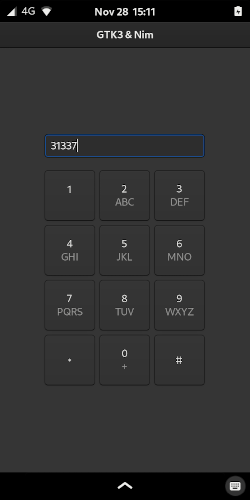

# nim + gintro + libhandy example

## How to build
1. Build and install libhandy
2. install aarch64-linux-gnu-gcc (`apt install gcc-aarch64-linux-gnu` on Ubuntu)
3. `nimble build --cpu:arm64 --os:linux`

## TODO
- port handy-1-demo

